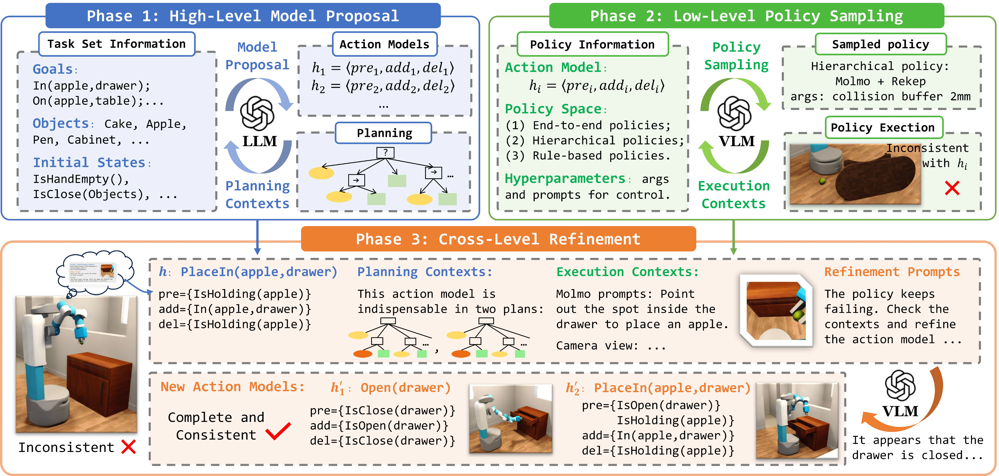

<div align="center">

# CABTO

### Context-Aware Behavior Tree Grounding for Robot Manipulation

**AAAI 2026** &nbsp;·&nbsp; [📄 Paper (PDF)](https://arxiv.org/abs/2603.16809) &nbsp;·&nbsp; [🌐 Project Page](https://dids-ei.github.io/Project/CABTO/)


-lightgrey)


*From natural-language task descriptions to grounded, self-correcting robot behaviors —
LLM symbolic planning · code-generated primitives · closed-loop effect verification.*

</div>

---

<p align="center">
  <b>English</b> &nbsp;·&nbsp; <a href="README_zh.md">中文</a>
</p>

---

## 📋 Table of Contents

- [Overview](#overview)
- [Highlights](#highlights)
- [Repository Layout](#repository-layout)
- [The Five Tasks](#the-five-tasks)
- [Quick Start](#quick-start)
- [Running the Experiments](#running-the-experiments)
- [Citation](#citation)
- [License](#license)

---

## 📌 Overview

**CABTO** is a framework for **grounding long-horizon robot manipulation** by tightly coupling
**LLM-based symbolic reasoning** with **formal behavior-tree planning** and a
**closed-loop, self-correcting execution engine**.

Given a task described in natural language (or BDDL), CABTO:

1. Uses an **LLM** to produce a *context-aware* symbolic plan / behavior library, where every skill is modeled as `⟨pre, add, del⟩` (preconditions, add-effects, delete-effects).
2. Synthesizes a **minimum-cost, executable behavior tree** via the **HOBTEA / OBTEA** planning algorithms.
3. **Grounds** each abstract action into low-level motor commands through *code-generated composable primitives*.
4. **Verifies** every step against ground-truth (with optional VLM cross-checking), and on failure **feeds the violation back to the planner and re-plans** — a self-correction loop bounded by `max_rounds = 3`.

<div align="center">
<a href="images/framework.pdf"></a>
</div>

---

## ✨ Highlights

| | |
|:-|:-|
| 🧠 **LLM Symbolic Planning** | Context-aware behavior libraries, every skill modeled as `⟨pre, add, del⟩` |
| 🌳 **Formal BT Planning** | Minimum-cost, executable behavior trees via **HOBTEA / OBTEA** |
| 🛠 **Code-Generated Primitives** | Composable low-level motor primitives, generated instead of hand-written |
| 🔁 **Self-Correction Loop** | Per-step ground-truth verification + re-planning, bounded by `max_rounds = 3` |
| 🖥 **Fully On-Device** | MuJoCo 3.10 physics + MLX-VLM grounding on Apple Silicon — no cloud, no Isaac Sim |

---

## 🗂 Repository Layout

> This repository is organized around a **self-contained, five-task minimal reproduction package**
> on `main`, while the **original full CABTO codebase** is preserved on the
> [`last`](https://github.com/DIDS-EI/CABTO/tree/last) branch.

| Branch | Content |
|:------:|---------|
| [`main`](https://github.com/DIDS-EI/CABTO) | Five-task minimal reproduction package — active task code, formal-BT evidence, Panda assets, Oracle/Qwen-VL pointing & closed-loop results |
| [`last`](https://github.com/DIDS-EI/CABTO/tree/last) | Original full codebase — `btgym/`, `exps_bt_learning/`, `exp2_low_level_codegen/`, `exp4_bt_tasks/`, `reproduce/`, `docs/`, `images/` (see the [original README](https://github.com/DIDS-EI/CABTO/blob/last/README.md)) |

A detailed guide to the minimal reproduction package is in [`MINIMAL_REPRO.md`](MINIMAL_REPRO.md)
(中文); a browsable dashboard is in [`index.html`](index.html).

### Directory overview

```
CABTO/
├── project/                      # ── 5-task source code, current configs & program cache
│   ├── core/                     #   task APIs / bridges / grounding / codegen contracts
│   ├── scenes/                   #   active scene JSON for the 5 tasks
│   ├── data/programs/            #   cached model-generated programs
│   ├── assets/                   #   task textures (e.g. tea-carton label)
│   ├── mujoco_workspace/         #   articulated Franka MuJoCo assets
│   ├── probe_*.py  run_*.py      #   task probes & runners (5 tasks)
│   ├── test_*.py   verify_*.py   #   per-task tests & verifiers
│   └── test_fixtures/  tests/    #   regression fixtures & test assets
│
├── CABTO/exp4_bt_tasks/          # ── Experiment 4 runtime (minimal)
│   ├── stage2_scripted/          #   hand-written scripted experts (dual-arm engine base)
│   ├── stage3_cabto/             #   single-arm full CABTO closed loop (planner/codegen/checker/loop)
│   ├── scenes/  assets/          #   Panda body definition & mesh assets
│
├── BTExpansion-demo/src/         # ── formal BT-expansion kernel
│   ├── behavior_lib/             #   sequence / selector / inverter node library
│   ├── behavior_tree/            #   BehaviorTree data structure + PTML
│   ├── bt_expansion/             #   BT expansion engine
│   ├── pddl_adapter/             #   PDDL ↔ BT adapter
│   └── utils/
│
├── reports/                      # ── polished experiment report pages (uploaded to GitHub)
│   ├── remaining_cabto/          #   5-scene CABTO unified report + camera pointing (main entry)
│   ├── cover_cabto_fix/          #   Cover generation & visual placement fix report
│   └── cover_cabto_method/       #   early Cover method experiment (historical)
│
├── tasks/                        # ── per-task evidence (cover / blocks / pour / handover / storage)
│   ├── <task>/direct/            #   direct execution: rollout.mp4, result.json, scene, phases
│   ├── <task>/generated_bt/      #   generated programs, formal BT (JSON/DOT/SVG), replay
│   └── <task>/config.json · metadata.json · report.html
│
├── paper_reproduction/           # ── paper experiment evidence
│   ├── perception_pointing/      #   Experiment 2: Oracle/Qwen-VL pointing code, eval JSON, overlays, MP4, HTML
│   └── stage3_closed_loop/       #   Stage 3 oracle/qwen closed-loop results + step images
│
├── tests/results/                #   164 unit-test logs + 5-task generated-BT smoke summary
│
├── outputs/                      # ── FULL raw experiment outputs (LOCAL ONLY, git-ignored)
│   ├── remaining_cabto/          #   complete 5-task CABTO migration runs (model proposals / sampling / refinement)
│   ├── cover_cabto_fix/          #   Cover fix full runs
│   ├── cover_cabto_method/       #   Cover method full runs
│   ├── unified_cameras/          #   unified camera-rig snapshots
│   └── chinese_paper/            #   Chinese paper source (ctexart)
│
├── index.html                    #  browsable dashboard (portal to reports/ + tasks/ + paper_reproduction/)
├── run_task.py                   #  direct execution entry for the 5 tasks
├── run_generated_bt.py           #  replay generated programs + formal BT
├── run_tests.py                  #  unit-test runner
├── verify_package.py             #  package integrity verification
├── requirements.txt              #  Python dependencies
└── package_manifest.json · PROVENANCE.json   #  manifest (SHA256) & provenance
```

### Experiment outputs: `reports/` vs `outputs/`

- **`reports/`** (uploaded to GitHub): polished, self-contained report pages extracted from `outputs/` —
  only the report HTML and the assets they directly reference (mp4 / png / svg / json). These power the
  online [`index.html`](index.html) portal.
- **`outputs/`** (local only, git-ignored): the complete raw experiment outputs (~1.3 GB) with every model
  proposal, policy-sampling attempt, effect refinement, and per-run collision audit. Kept locally for full
  reproducibility, not committed (contains files >100 MB and large intermediate artifacts).

| Output directory | What it records |
|------------------|-----------------|
| `outputs/remaining_cabto/` | Complete 5-task CABTO migration runs — per-task `proposal/` → `sampling/` → `refinement/` → `final_seed0/1/`, plus `summary.json` and `reproduce.txt` |
| `outputs/cover_cabto_fix/` | Cover generation & visual-placement fix runs |
| `outputs/cover_cabto_method/` | Early Cover method experiment (historical) |
| `outputs/unified_cameras/` | Unified camera-rig snapshots |
| `outputs/chinese_paper/` | Chinese paper source (ctexart + xelatex + biber) |

---

## 🎯 The Five Tasks

The `main` branch reproduces five long-horizon manipulation tasks end-to-end:

| Task | Scene | Instruction | Evidence |
|:----:|:------|:------------|:---------|
| 🍤 **Cover** | `cover_kitchen_sort_v2` | Pair-place three objects — shrimp → bowl, apple → board, potato → pot | `tasks/cover/` |
| 🧱 **Blocks** | `blocks_rebuilt_v1` | Stack blocks, then return home | `tasks/blocks/` |
| 🥣 **Pour** | `held_basin_pour_smooth_v2` | Dual-arm: hold the basin while pouring balls in, then return | `tasks/pour/` |
| 🤝 **Handover** | `handover_tea_box_v3` | Handleless three-box air handover between arms | `tasks/handover/` |
| 📦 **Storage** | `packing_dual_lift_shelf_storage_v3` | Pack items into a carton, dual-lift it onto the shelf | `tasks/storage/` |

---

## ⚡ Quick Start

**Environment** — Python 3.11.9 · MuJoCo 3.10.0 · NumPy 2.4.6 · SciPy 1.17.1 · Pillow 12.2.0 · imageio 2.37.3

```bash
python3.11 -m venv .venv
.venv/bin/pip install -r requirements.txt
```

> To re-run the local Qwen visual-grounding experiments on Apple Silicon, additionally install
> `mlx-vlm`. Model weights are **not** bundled in this package.

---

## ▶️ Running the Experiments

**1. Direct execution of the five tasks**

```bash
PY=.venv/bin/python
$PY run_task.py cover    --output runs/direct_cover
$PY run_task.py blocks   --output runs/direct_blocks
$PY run_task.py pour     --output runs/direct_pour
$PY run_task.py handover --output runs/direct_handover
$PY run_task.py storage  --output runs/direct_storage
```

**2. Replay the generated programs & formal behavior trees**

```bash
$PY run_generated_bt.py cover    --output runs/generated_cover
$PY run_generated_bt.py blocks   --output runs/generated_blocks
$PY run_generated_bt.py pour     --output runs/generated_pour
$PY run_generated_bt.py handover --output runs/generated_handover
$PY run_generated_bt.py storage  --output runs/generated_storage
```

**3. Run the test suite**

```bash
.venv/bin/python run_tests.py     # 164 tests, all passing
```

> See [`MINIMAL_REPRO.md`](MINIMAL_REPRO.md) for task-by-task details, evidence paths, and experiment boundaries.

---

## 🔖 Citation

```bibtex
@inproceedings{cabto2026,
  title     = {Context-Aware Behavior Tree Grounding for Robot Manipulation},
  author    = {Cai, Yishuai and others},
  booktitle = {Proceedings of the AAAI Conference on Artificial Intelligence (AAAI)},
  year      = {2026}
}
```

---

## 📄 License

Released under the **MIT License**. The full original CABTO codebase lives on the
[`last`](https://github.com/DIDS-EI/CABTO/tree/last) branch.

---

<div align="center">

*Context-aware symbolic planning · formal behavior trees · grounded, self-correcting execution.*

</div>
